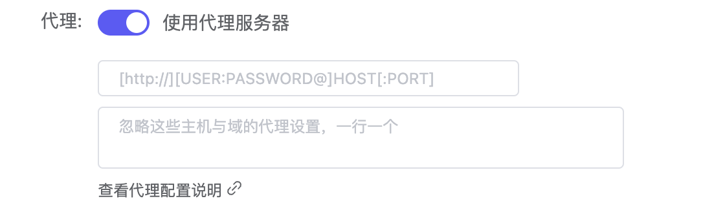

    

<h1 align="center">CuteKona</h1>

基于Playwright, 各种瑟瑟图片网站的爬虫

# 前言

由于该项目的特殊性，~~该项目有几率随时被删除，懂自懂。~~

# 目标

还是由于该项目的特殊性，以下网站请自行搜索，这里不贴网址。

目前已实现：
| 网站名  | 备注 |
|    -   |  -  |
| K站 | K 欧 恩 诶 西 诶吃 诶 恩 点com  |
| 未完待续... | 科科... |

# 特性
* K站
    * 全站高级搜索✅
    * 分页爬取✅

# 爬取成果
由于图片都比较大，很多超过4K分辨率，所以只爬取链接, 请自行使用下载工具下载

推荐的下载工具：**Motrix**

[https://github.com/agalwood/Motrix](https://github.com/agalwood/Motrix)

温馨提示，需要魔法，在Motrix中配置代理服务器即可

# 如何使用该程序
直接安装npm发布包

~~~shell
npm install cutekona
~~~

然后引入，调用函数即可

~~~js
const konachan = require("konachan")
/**
 * Konachan爬取主函数
 * @param {*} tags 传入要查询的tag
 * @param {*} pages 传入一个数组，里面是所有要爬取的页码
 * @param {*} size 根据大小搜索，传入一个对象： { sizeType, width, height }, sizeType为枚举值，width, height为数字，可以不传
 * @param {*} order 按照指定顺序检索(传入枚举值)，可以不传
 * @param {*} rating 按照图片分级检索(传入枚举值)，可以不传
 */
konachan("hoshino_ai", [1])
~~~